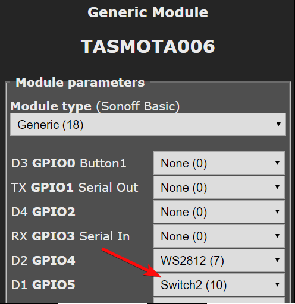
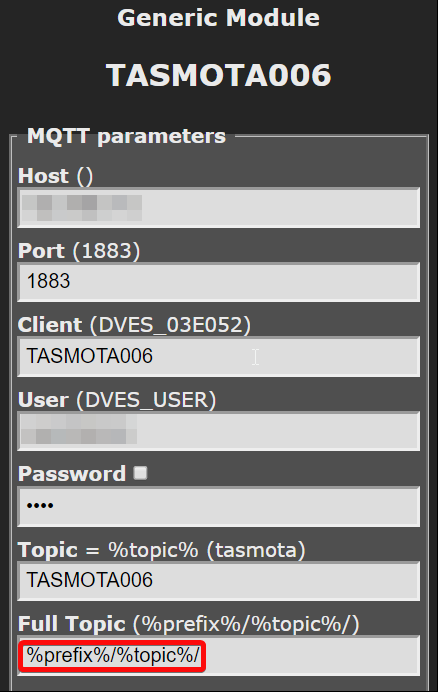
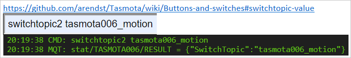
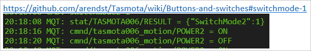
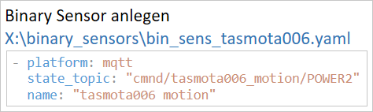
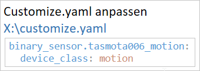
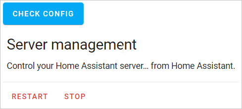
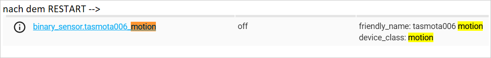
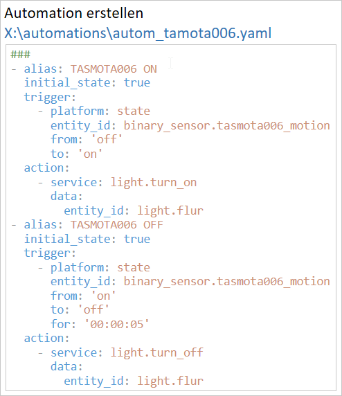

# RCWL-0516---Microwave-Radar-Sensor
RCWL-0516 4-28V 3mA Microwave Radar Sensor

  
Folgendes in der Konsole von Tasmota eingeben:

  
In der Konsole zusätzlich den Switchmode2 auf 1 ändern

 

 

 

 

 

